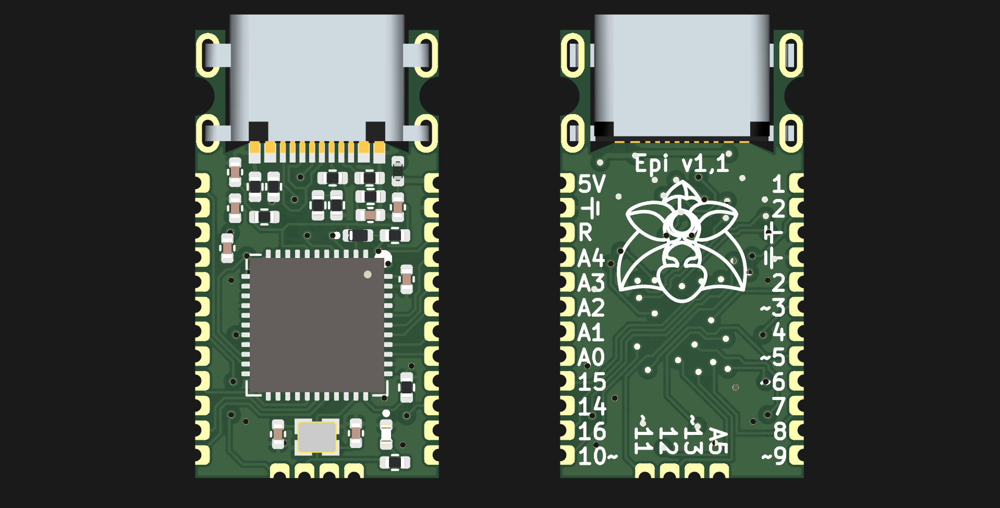

# Epi

Named after the Epipactis genus or orchids. The flower of one appears on the bottom of the board.

With such "amazing" features as:

Data line ESD protection taken from the official A. micro.

Crenellated pins.

No integrated voltage converter, only runs at 4,5-5,5v(down to 2,7 if you make it with an 8mhz crystal, or use the internal oscillator).

USB-C connector sunk into the board, and slighly portruding from the end for panel mounting.

1,27mm pin spacing.

Some extra pins broken out.

Way too many hours routing for my sanity, and i doubt it's optimal(i am a beginner).

Holes where M2 bolts can be used to hold it in place.

No rx/tx/power LEDs. Only one on pin 13 for testing.

Made to suit JLC manufacturing tolerances.

Includes some custom footprints with 3D models.

Size comparisons.
